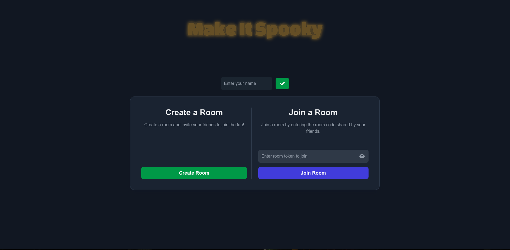
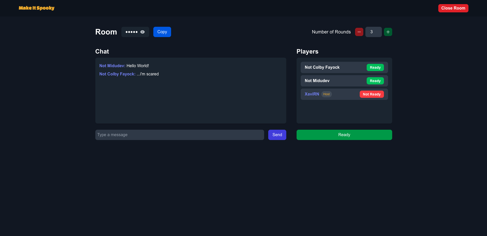
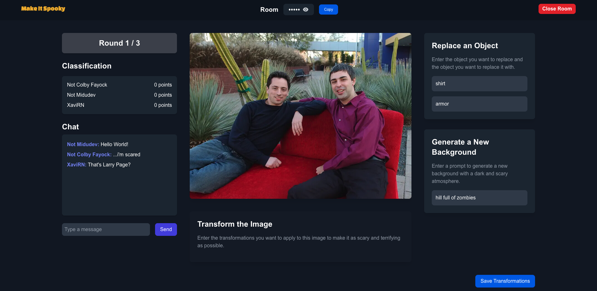
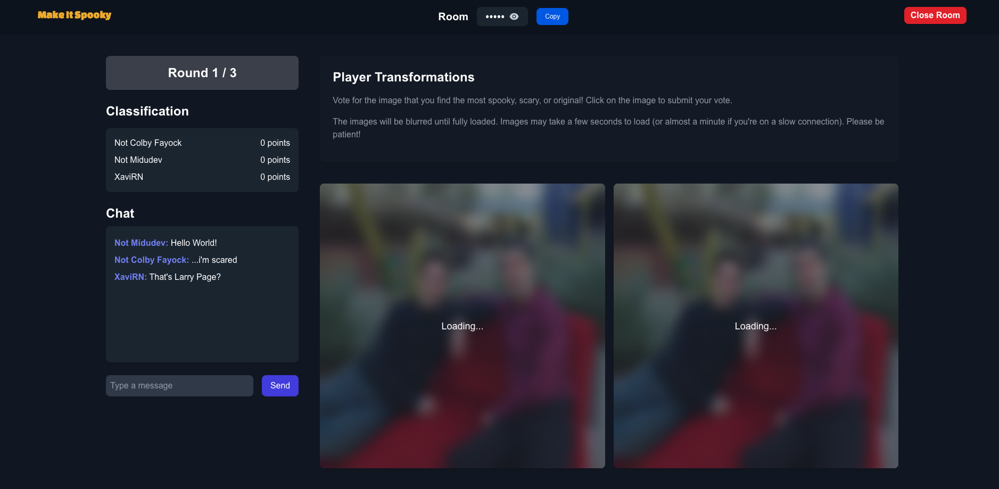
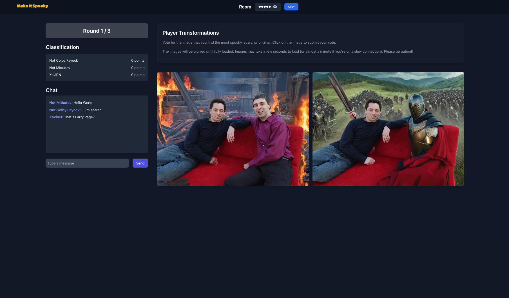

# Make it Spooky 🎃

Hello! My name is Xavi Ramon Nicolau (XavirN) and Welcome to my project for the **[Cloudinary Halloween Hackathon](https://cloudinary.com/blog/cloudinary-cloudcreate-spooky-ai-hackathon)**!

For this project, I wanted to do something a little different. Since I had never created a "game" in the browser and had never used Real-Time Database before, this seemed like the perfect opportunity to try both.

**Make it Spooky** is a browser-based game where you and 3 or more friends (or just several browser windows or sessions if you're playing alone) can compete to create the spookiest image possible and crown the winner!

### How to Play:

- One player must create a room. A token will be generated that you can share with your friends to allow them to join your room.
- Once everyone is ready, the host can start the game.

### Game Phases:

Each round, everyone will be given a common image, and each player can:

- Replace an element in the image.
- Generate a new background using a prompt.

After selecting your transformations, you'll wait for the other players to finish their edits, then we'll move on to the next stage. At this point, you'll view the spooky transformations made by other players, and you'll vote for the one you like the most.

The player with the most votes earns points, and the game continues to the next round. Finally, the player with the most votes will be crowned the winner!

### Usage Tips:

- It is recommended to open the game in different browsers or sessions, and have one create the room so you can test it solo.
- Be patient with image loading, as it might take some time. Even if the image link seems broken, the game will retry loading it several times in case of failure.
- I hope my credits dont run out before Cloudinary or Midudev tries this project. If they do, pleae refill them! My cloud is xavirn-hackaton (sorry)

### What I Would Have Done With More Time:

Due to personal and work commitments, I couldn't dedicate as much time as I would have liked. However, here are some features and improvements I would have added with more time:

- **Optimize image loading**: I wanted to test what would be more efficient: creating image URLs during phase 0 of the game and loading them in phase 1, or keeping the current approach where transformations are saved in phase 0 and applied directly in `<CldImage />` during phase 1.
- **Background music**: Adding background music with volume control, mute options, and the ability to toggle it on/off.
- **Animation replay**: Adding a flag to allow users to replay the branch animation upon entering the game, if desired.
- **Improved AfterGame screen**: Enhancing the final screen where the rankings and confetti display, making it more interactive.
- **Better points system**: Refining and optimizing how points are assigned based on votes.

Thank you for checking out **Make it Spooky**, and I hope you have fun trying it out!

### Connect with Me:

- **[LinkedIn](https://www.linkedin.com/in/xavi-ramon-nicolau-08289a261/)**
- **[GitHub](https://github.com/xavirn89)**
